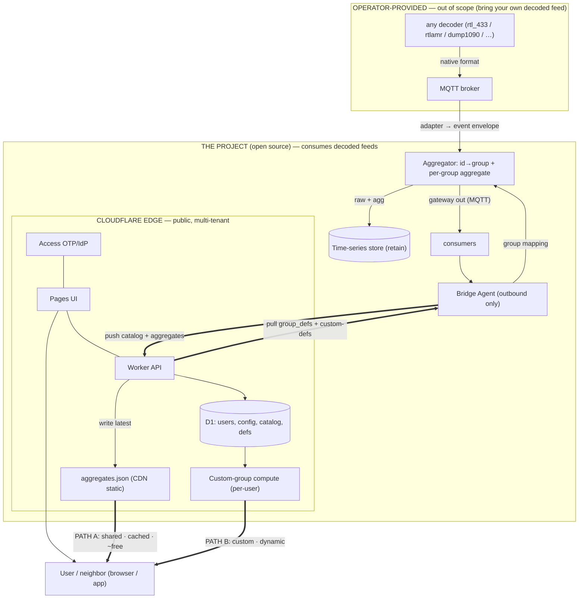

# Decoded-RF Aggregation / Integration / Gateway Platform (open source)

## Context
An open-source tool that **consumes decoded RF event feeds**, aggregates/groups them, retains and
gateways the results, and serves them to multiple users through a Cloudflare edge front (sign-up, auth,
per-user config). The operator self-hosts the heavy/private backend on **any container host**; Cloudflare
fronts everything user-facing. Designed **hardware-agnostic and format-flexible** — not tied to any
specific dongle, host, decoder, band, or device.

Roles: **integrate** many decoded sources into one normalized stream; **aggregate** numeric sensor data
by logical group; **gateway** results out (MQTT + edge). Principles: modular, composable, configurable,
easy; nothing hardcoded; off-the-shelf where possible; flexible ingestion; the one small custom piece
tightly scoped.

*Reference dev environment (incidental, not the design): maintainer runs an RTL-SDR + rtl_433 on a
Proxmox LXC. The tool assumes none of this — it starts at the decoded feed.*

## Scope boundary — the project consumes decoded feeds; it does NOT manage SDRs/decoders
- **Out of scope (bring-your-own):** dongles, drivers, frequencies, and the decoder software. The operator
  supplies a decoded feed.
- **In scope:** everything from the feed onward — ingest → aggregate/group → retain → gateway → edge.

## Ingestion — pluggable adapters, no format lock-in
- **Internal model = schema-light event envelope:** `{ ts, source, type, id, lat?, lon?, fields{…} }` —
  holds a sensor reading, an aircraft position, or a meter reading without a rigid schema.
- **One adapter per decoder** maps native output → the envelope, over MQTT+JSON. **No single universal
  format exists across domains** — different decoders, different data models:
  - **rtl_433** → one JSON schema, band-agnostic (315/433/868/915); umbrella for weather, **TPMS, tank
    gauges, moisture meters, alarms/security, energy**. **v1 adapter.**
  - **rtlamr** (utility meters) → JSON/CSV — future adapter.
  - **dump1090/readsb** (ADS-B aircraft) → SBS/BaseStation CSV, Beast, `aircraft.json` — future adapter.
  - **rtl_ais** (marine AIS) → NMEA 0183 — future adapter.
- **Aggregation is domain-specific:** group-average applies to **numeric sensor** events; other domains
  (aircraft/AIS/…) ride the same ingest→retain→gateway→multi-tenant spine but are carried/served, not averaged.
- v1 ships the rtl_433 adapter; the adapter + envelope mean other domains slot in with no redesign.

## Architecture & flow (optionality is first-class — BOTH read paths ship in v1)

**BACKEND (operator-hosted, private, any container host):** adapter consumes the decoded feed →
**Aggregator** (Telegraf: id→group + per-group aggregate) → **time-series store** (InfluxDB) retain +
**MQTT gateway out**. A small outbound-only **bridge agent** pushes **catalog + per-sensor latest values +
shared aggregates UP** to Cloudflare and pulls **group_defs + custom-defs DOWN** → group mapping → reload.
No inbound, service-token auth.

**EDGE (Cloudflare, public, multi-tenant):** Access (OTP/IdP), Pages UI (signup / config / view), Worker
API (ingest / config / read), D1 (`users`, `user_config`, `catalog`+latest, `aggregates`, `defs`).
*(Open self-serve signup flow via Access to verify at build.)*

**Two co-equal read paths — BOTH in v1:**
- **Path A — SHARED:** admin groups aggregated once on the backend; Worker writes `aggregates.json` served
  as a **Pages static / CDN** asset. Identical for all users, changes each `AGG_PERIOD` → cache hit skips
  Worker/CPU/D1 (verified) → effectively unlimited free reads, scales to any # of users.
- **Path B — CUSTOM per-user:** a user defines their own sensor set; the **Worker computes that group's
  current average on demand from D1 latest values**. Personalized → uncacheable → per-request compute
  (the throughput/cost path). Opt-in per user. Current-value custom is v1; historical custom is future.

## Custom code inventory (honest)
| Piece | Where | Language | Notes |
|---|---|---|---|
| Worker API (ingest / config / read, Access-gated) | Cloudflare | JS/TS (isolates, not Node) | moderate |
| Pages UI (signup, config, view) | Cloudflare | JS/TS | moderate |
| Custom-group compute (Path B) | Cloudflare Worker | JS/TS | v1; per-user on-demand from D1 |
| Bridge agent (push up / pull down → mapping → reload) | backend | Python (`paho-mqtt`+`httpx`) or Go | small, headless |
| rtl_433 adapter (feed → envelope) | backend | config/thin | v1 (Telegraf parse + normalize) |
| Aggregator / store | backend | none (off-the-shelf Telegraf + InfluxDB) | config only |

## Open-source shape
- The **feed→envelope adapter**, the **backend↔edge API contract**, and the **config schemas** are
  documented, versioned interfaces → backend, edge, adapters, and the custom module are independently
  swappable/self-hostable. Repo: `/adapters`, `/backend`, `/edge`, `/docs` (contracts). License TBD.
- Nothing hardcoded: backend scalars in env (`AGG_PERIOD`, topics, broker, edge URL + service token);
  opt-in field-trim / dedup / downsample default OFF.

## Free-tier fit (Cloudflare limits verified this session)
- **Path A reads ~free at any scale** (CDN-cached static; cache hits skip Worker/CPU/D1 — verified).
- **Path B reads are the throughput variable** — uncacheable per-user compute, billed as Worker requests +
  CPU (free: 100k req/day, 10ms CPU/req; D1 5M reads/day). Small user counts fine; high fan-out → per-user
  short-TTL cache or Durable Objects WebSocket push (free tier, SQLite backend).
- Ingest tiny; storage never bites (aggregates KB; bulk stays in the backend store).

## Build order
1. **Backend**: rtl_433 adapter → Aggregator (Telegraf group-aware) → InfluxDB retain + MQTT gateway;
   `telegraf --test`; deploy on any container host. Confirm per-group topics + retention.
2. **Edge core**: D1 schema → Worker (ingest/config/read, Access-gated) → Pages UI → Access. Free tier.
3. **Bridge agent**: push catalog+aggregates up, pull defs down → mapping → reload.
4. **Path B (custom, v1)**: Worker computes per-user custom-group averages on demand from D1 latest.
5. **End-to-end multi-user**: Access sign-in; select shared groups (A) and/or define custom (B); admin
   edits group_defs; unmapped ids surface as `unassigned`.

## Holes / risks
- **Real (if small) multi-tenant app** — biggest scope is Worker+UI (both paths + config + auth). "30-day"
  risk lives there; keep v1 tight.
- **Aggregation is numeric-sensor-specific** — non-sensor domains carried/served, not averaged.
- **Cloudflare Access open self-serve signup flow** — verify at build.
- **Aggregator mapping reload** — verify whether the lookup hot-reloads or needs a restart.
- **Path B fan-out** at scale — mitigate with caching / Durable Objects.
- **Privacy**: serve anonymous aggregates, not per-source identifiable data tied to specific locations.

## Verification
- `telegraf --test` → correct per-group aggregates; MQTT gateway topics update each `AGG_PERIOD`.
- Store retains raw + aggregates.
- Backend agent lands catalog+aggregates in D1; edge read API returns them.
- Two test users behind Access see the shared view (A) and a custom group (B); group_def edit changes
  membership within a sync.

## Future / extension (NOT this plan)
- Additional decoder adapters: **rtlamr** (meters), **dump1090/readsb** (ADS-B), **rtl_ais** (AIS).
- Historical custom-group series (Path B over time; needs backend raw).
- Consumption clients (MQTT phone apps, etc.) off the gateway / edge read API.
- Automatic sensor classification; scale-out reads (Durable Objects / edge cache).
